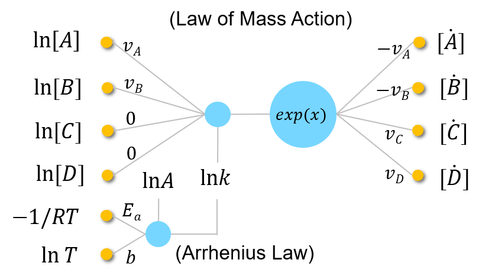

# CRNN (Chemical Reaction Neural Network)

You can find the common questions regarding CRNN in the [FAQs](https://github.com/DENG-MIT/CRNN/wiki/FAQs).

# Cite
Ji, Weiqi, and Sili Deng. "Autonomous Discovery of Unknown Reaction Pathways from Data by Chemical Reaction Neural Network." arXiv preprint arXiv:2002.09062 (2020). [pdf](https://arxiv.org/abs/2002.09062)
