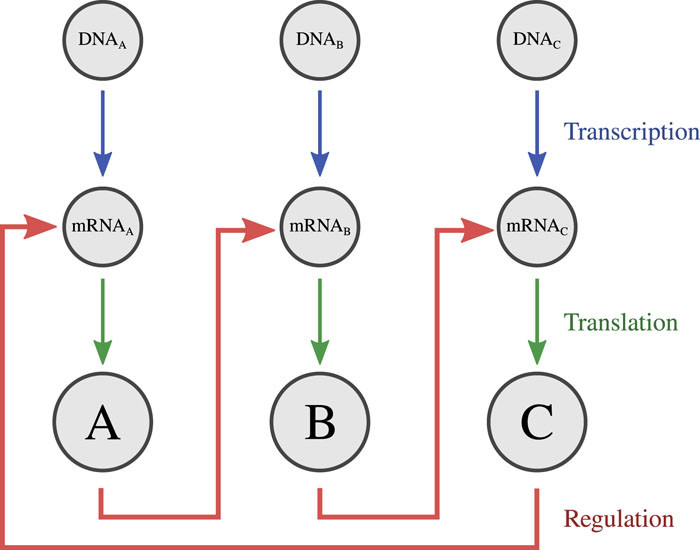
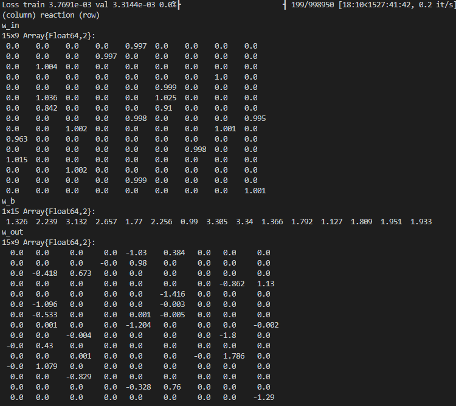

# Gene Regulatory Network

This example is adopted from Hoffmann, Moritz, Christoph Fröhner, and Frank Noé. "Reactive SINDy: Discovering governing reactions from concentration data." The Journal of Chemical Physics 150, no. 2 (2019): 025101.

Sample results.

