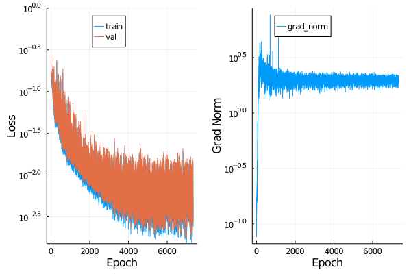
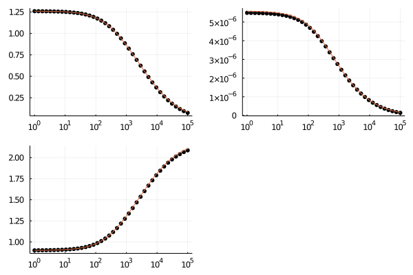
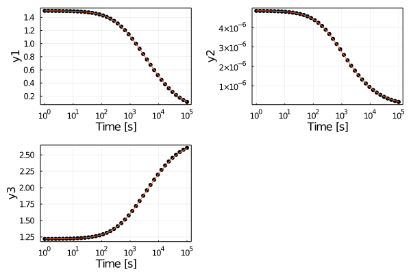

# Robertson's Problem

This example demonstrate the preliminary results on learning CRNN for systems with strong stiffness. Robertson's problem is a classical stiff chemical kinetic problems widely adopted to test stiff ODE solvers. The details of Robertson's problem and the introductions to stiffness can be found in https://arxiv.org/abs/2011.04520 and https://diffeq.sciml.ai/stable/tutorials/advanced_ode_example/.

We are actively working on understanding the difficulties of learning stiff Neural Ordinary Differential Equations. We will phase out a nice story on it soon.

For this Robertson's problem, a note on the number of proposed reactions is that proposing a onver-parameterized model seems to be easier to optimize. For instance, we know this system can be well approximated by a three-reaction systems. However, it could be difficult to optimize due to local minima. Instead, if we propose 6 reactions, the chaance of successful optimization is much higher. To get a sparse model for better interpretability, we could employ standard model reduction methods to identify essential pathways. For example, the leave one out method, one can disable a reaction each time and see the effect. Tne you will be able to identify the essential three reactions.

## Loss funtions

## Profiles

## CRNN weights
    julia> display_p(p)
    species (column) reaction (row)
    w_in | w_b | w_out
    6×7 Array{Float64,2}:
    2.5       1.61821  1.82531   16.4681    -1.31015e-5  -29199.4        -9.06493
    0.194654  1.81441  0.0       24.4825    -5.07967      -2194.18        5.16405
    0.0       1.71672  1.82568   24.0435     0.0916024   -16210.3        -0.0870566
    0.0       0.0      0.0      -13.1789     0.0145153        0.0873887   0.0711276
    0.826669  0.0      0.0        0.114739  -0.140722         0.160659    0.0953954
    1.68456   0.0      0.0        7.43096   -1.36473e-6     154.215       1.44846e-9
    w_out_scale
    6×3 Array{Float64,2}:
    -1.44505e-6  -0.0173522   -1.0
    -0.983493    -0.0022889    1.0
    1.0         -0.953462    -0.950537
    0.204039     6.61854e-6   1.0
    -1.0          6.15126e-6   0.678017
    -0.00164248   1.0          1.74355e-6
    slope = 1.0110600333418567