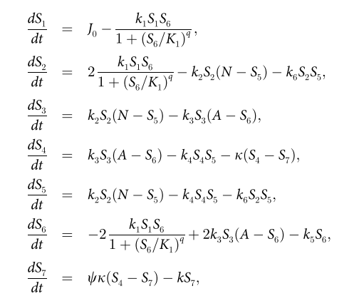
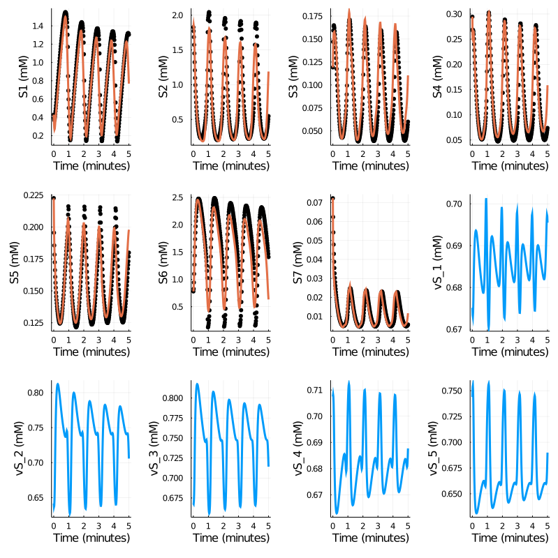
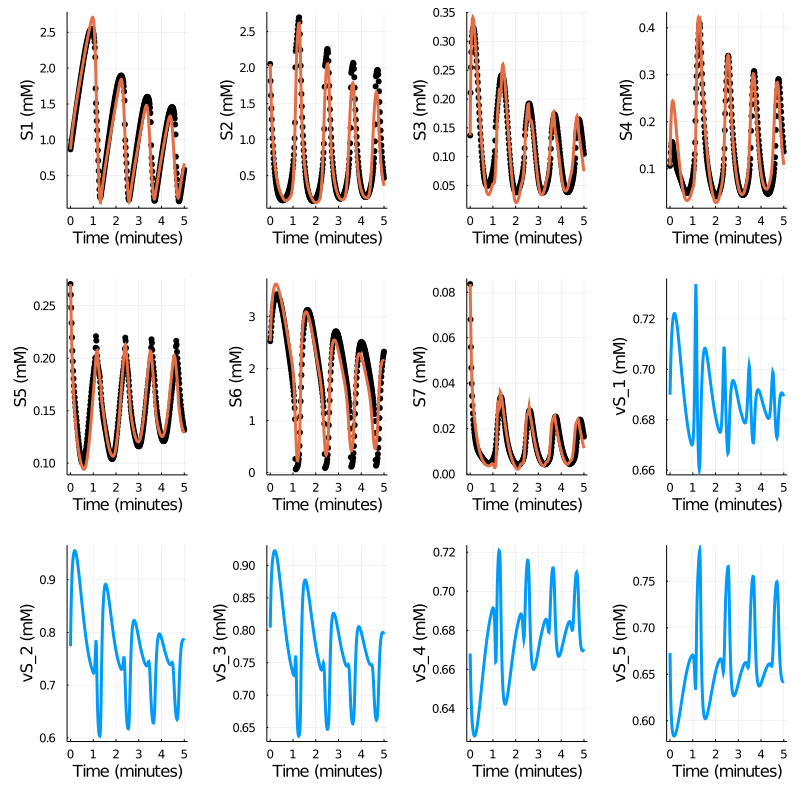

# Oscillations in Yeast Glycolysis

The model of oscillations in yeast glycolysis has become a standard test case for biochemical dynamics inference. The model conosists of ODEs for the concentrations of 7 biochemical species:



One of the challange for modeling such a system is that it contains rational functions, that it, species concentrations appears in both dominators and numerators. Such expressions are usually derived from Michaelis–Menten (MM) rate law. Good news is that MM rate law is derived from elemental reactions with Quasi-Steady State Asssumptions (QSSA). In another words, the system involves important species beyond the listed 7 species, and they are expressed as algebratic equations.

While CRNN is formulated based on the law of mass actions, mostly for elemental steps, we could incoorprate MM rate law into the structure in order to learn biochemical systems. Here we go the other way, Instead of learn the lumped reaction equations, we try to learn elemental steps by approaximate thsoe hidden species using another neural network.

This can be illustrated in the code
```Julia

node = ns_ - ns;
dudt2 = Chain(x -> x,
              Dense(ns, node, gelu),
              Dense(node, node, gelu),
              Dense(node, node, gelu),
              Dense(node, ns_ - ns, softplus));
pnn, re = Flux.destructure(dudt2);
rep = re(pnn);
p = vcat(pcrnn, pnn);

function crnn(du, u, pcrnn, t)
    u_ = vcat(u, rep(u))
    w_in_x = w_in' * @. log(clamp(u_, lb, ub))
    du .= (w_out * (@. exp(w_in_x + w_b)))[1:ns] .+ w_J
end

```

in which `u` is the 7 species, and `rep(u)` refer to the approximated hidden species.

We randomly generate 30 initial conditions following the work of Daniels and Nemenman 2015. They are soilt into training and validation dataset by the rate of 20:10.

Results for one of the training datasets


Results for one of the validation datasets


Further efforts will be directed to analyzing the learned CRNN weights and the dynamics of hidden species.

The most exiciting thing of this demo is that CRNN offers the flexibility to inference unknown unknown species, which is in distinct from inference unknown species.

Reference:
* Daniels BC, Nemenman I (2015) Efficient Inference of Parsimonious Phenomenological Models of Cellular Dynamics Using S-Systems and Alternating Regression. PLoS ONE 10(3): e0119821. doi:10.1371/journal.pone.0119821